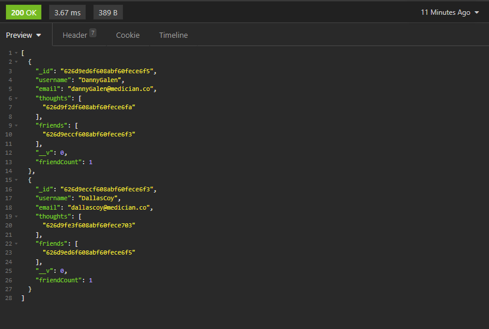
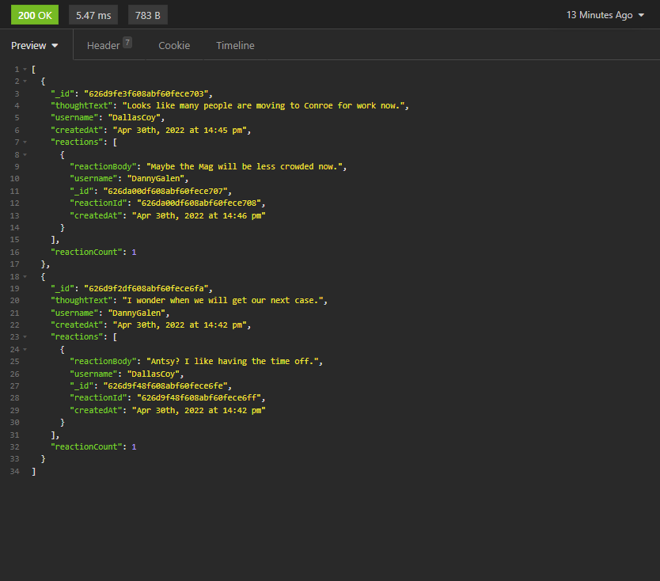

# SocialNetwork-API

**Video Walkthrough:** [Video coming soon!]

A basic social network API built using MongoDB. Users can post their thoughts, and view reactions from other users and friends!

## Tech

- Node.JS
- Mongoose
- ExpressJS

## Installation

- Run `npm init`
- Use `npm start` to start the server!

## Preview

### Example User JSON

### Example Thought JSON

